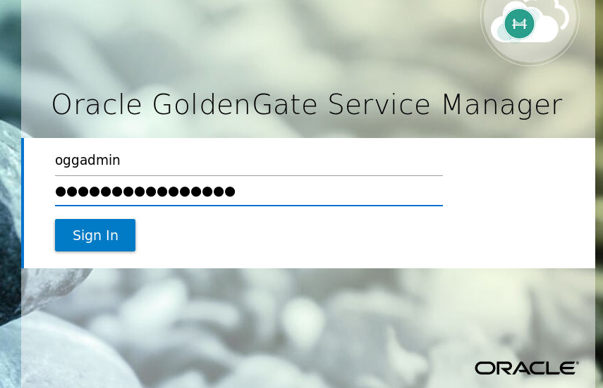
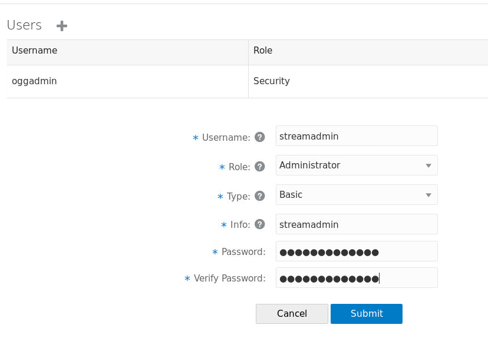

# **DBCS Configuration**

```
- sudo su - oracle
- update tnsnames and add cycpdb entry

connect sys/<password> as sysdba;
create user c##ggate identified by <password>;
grant dba to c##ggate;
alter session set container=cycpdb;
grant dba to c##ggate;

begin
dbms_goldengate_auth.grant_admin_privilege('C##GGATE',container=> 'all');
end;
/

Note:  Be sure to specify container - all above or you will not be able to select a pdb in the GG UI.
 
connect sys/<password>@cycpdb as sysdba
create user cyc identified by <password>;
grant dba to cyc;

alter session set container=CDB$ROOT;
shutdown immediate;
startup mount
alter database archivelog;
alter database open;
ALTER SYSTEM SET ENABLE_GOLDENGATE_REPLICATION=TRUE SCOPE=BOTH;
ALTER DATABASE ADD SUPPLEMENTAL LOG DATA;
ALTER DATABASE FORCE LOGGING;
ALTER SYSTEM SWITCH LOGFILE;
SELECT supplemental_log_data_min, force_logging FROM v$database;
```

# **ADW Configuration**

```
alter user ggadmin identified by <password> account unlock;

alter user ggadmin quota unlimited on data;

select * from v$parameter where name = 'enable_goldengate_replication';

alter system set enable_goldengate_replication = 'true' scope=both; -- this should not be needed

create user cyc identified by <password>;

grant dwrole to cyc;
grant unlimited tablespace to cyc;
```

# **Marketplace Image - Microservices Configuration**

## **Create new admin user (not required, but is best practice)**

- Log into Service Manager



- Select Administrator


- Add user



## **Review Deployments**

When you deployed the marketplace image and you took the defaults you may or may not have properly specified the source and/or target database versions.  Source and Target with db12c was the default.  In the case where both source and target databases are the same version (ie 18c in our case), you actually only need one deployment.  That is, both source and target config is on one deployment.  So in this case the word 'Source' is misleading.  However this set up did use two deployments.  If your source and target are different versions then you would need more than one deployment (eg: source 12c and target 19c).  

If you incorrectly specified the versions when you deployed the image you can change this here.  Select Source.

