# **DBCS Configuration**

```
- sudo su - oracle
- update tnsnames and add cycpdb entry

connect sys/<password> as sysdba;
create user c##ggate identified by <password>;
grant dba to c##ggate;
alter session set container=cycpdb;
grant dba to c##ggate;

begin
dbms_goldengate_auth.grant_admin_privilege('C##GGATE',container=> 'all');
end;
/

Note:  Be sure to specify container - all above or you will not be able to select a pdb in the GG UI.
 
connect sys/<password>@cycpdb as sysdba
create user cyc identified by <password>;
grant dba to cyc;

alter session set container=CDB$ROOT;
shutdown immediate;
startup mount
alter database archivelog;
alter database open;
ALTER SYSTEM SET ENABLE_GOLDENGATE_REPLICATION=TRUE SCOPE=BOTH;
ALTER DATABASE ADD SUPPLEMENTAL LOG DATA;
ALTER DATABASE FORCE LOGGING;
ALTER SYSTEM SWITCH LOGFILE;
SELECT supplemental_log_data_min, force_logging FROM v$database;
```

# **ADW Configuration**

```
alter user ggadmin identified by <password> account unlock;

alter user ggadmin quota unlimited on data;

select * from v$parameter where name = 'enable_goldengate_replication';

alter system set enable_goldengate_replication = 'true' scope=both; -- this should not be needed

create user cyc identified by <password>;

grant dwrole to cyc;
grant unlimited tablespace to cyc;
```

# **Marketplace Image - Microservices Configuration**

## **Create new admin user (not required, but is best practice)**

- Log into Service Manager


- Select Administrator


- Add user


## Upload ADW Wallet and update tnsnames.ora and sqlnet.ora on image

- Log into your marketplace image with ssh and 

## **Review Deployments**

When you deployed the marketplace image and you took the defaults you may or may not have properly specified the source and/or target database versions.  Source and Target with db12c was the default.  In the case where both source and target databases are the same version (ie 18c in our case), you actually only need one deployment.  That is, both source and target config is on one deployment.  So in this case the word 'Source' is misleading.  However this set up did use two deployments.  If your source and target are different versions then you would need more than one deployment (eg: source 12c and target 19c).  

- If you incorrectly specified the versions when you deployed the image you can change this here.  Select Source.

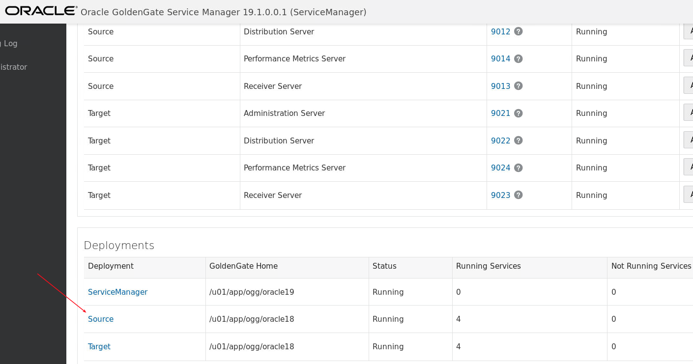

- Review the configuration and update as needed (ie: from oracle12 to oracle18).

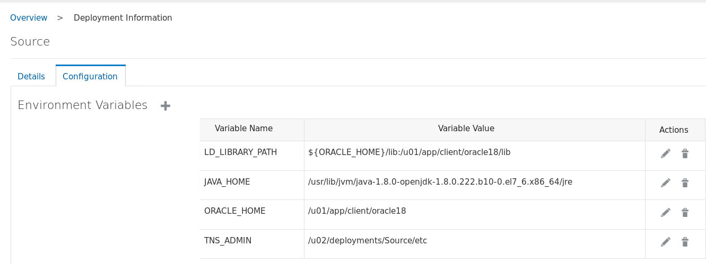

- Restart if you made any changes.

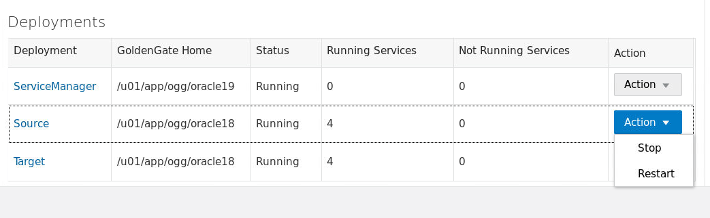

## Upload ADW Wallet and update tnsnames.ora and sqlnet.ora on image

- Log into your marketplace image with ssh and cd to `/u02/deployments/Source/etc`.  Create a tnsnames.ora file here and enter your CDB and PDB entries from your DBCS database (which in our case is the source).

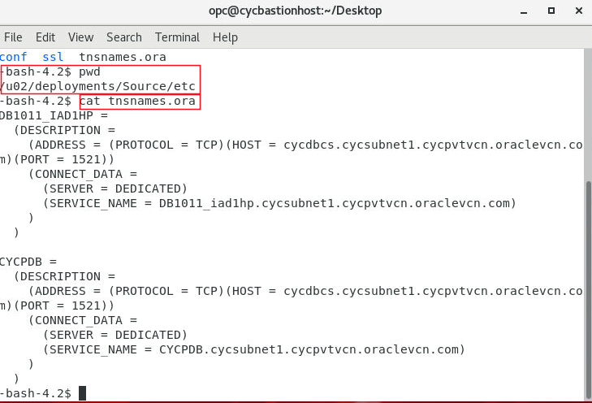

- Change to your target directory (again - you could have just the one deployment and everything would be in Source, but we did not do that in this case). and put your ADW wallet in the `/u02/deployments/Target/etc` directory.  Unzip the wallet file.

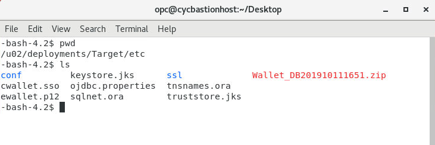

- update the sqlnet.ora file and enter the wallet location.  You can put this elsewhere if you choose.

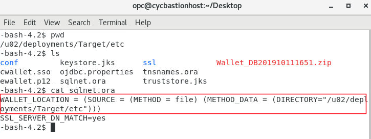

## **Configure Source**

- Select Administration Server


- Select Configuration

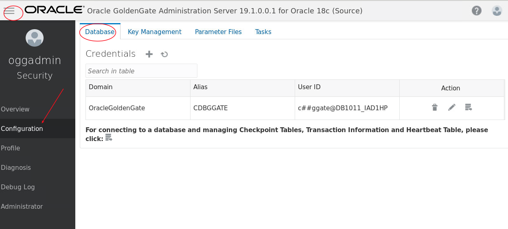

- Add Credential - this is a CDB connection using the gg user you created above.  Note the screenshot shows we already created this.

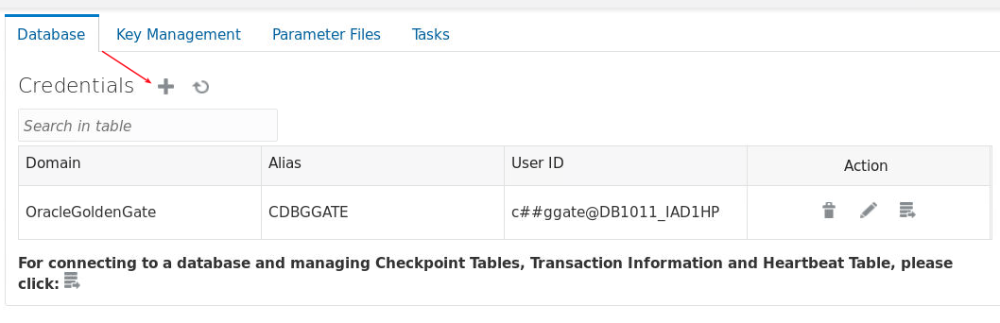

- Enter user details, and then scroll down to add schematrandata.  Note the following:
    - When you enter this it auto saves, and when you go back in you will not see it
    - You must search and specify pdb.schema
    - In our case cycpdb is the DBCS pdb name, and cyc is the schema.


- Confirm your connection is good

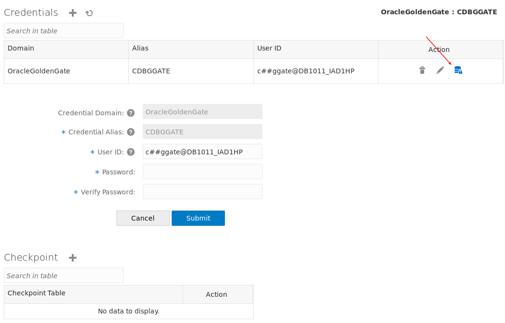

- Create new extract.

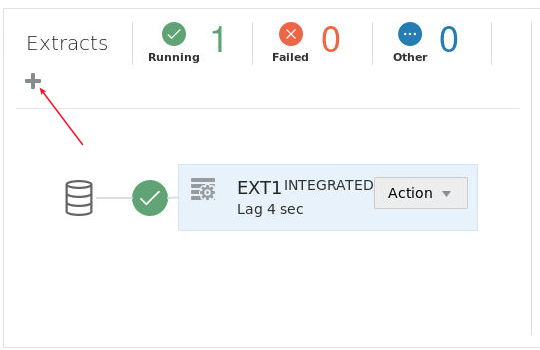

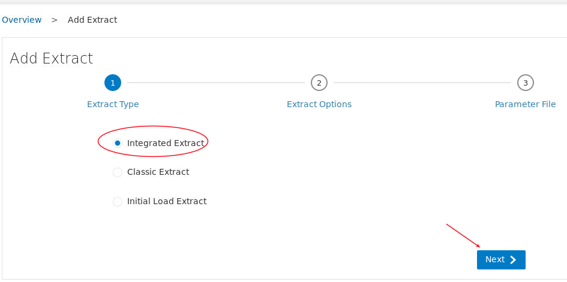


- Update the parameters as follows:

```
extract ext1
useridalias CDBGGATE domain OracleGoldenGate
exttrail aa
sourcecatalog cycpdb
table cyc.*;
```
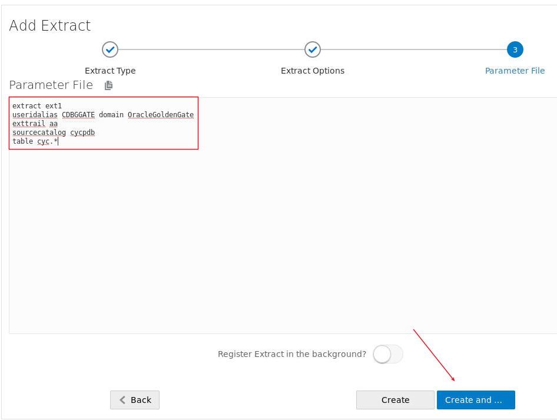